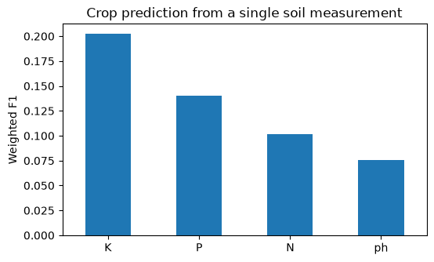

# Which soil measurement best predicts the right crop?

Multi-class logistic regression on soil nitrogen, phosphorous, potassium and pH to find the most informative single measurement and check for multicollinearity.



## Data

`soil_measures.csv`: 2,200 fields, 22 crops. The data comes from the DataCamp project of the same name.

## Key results

- Potassium is the best single predictor (weighted F1 of 0.20, against about 0.05 for random guessing).
- All four measurements together reach a weighted F1 of 0.68.
- P and K are correlated (0.74), but dropping either one cuts F1 to about 0.50, so both are worth keeping.

## Running the notebook

```bash
pip install -r requirements.txt
jupyter notebook notebook.ipynb
```
